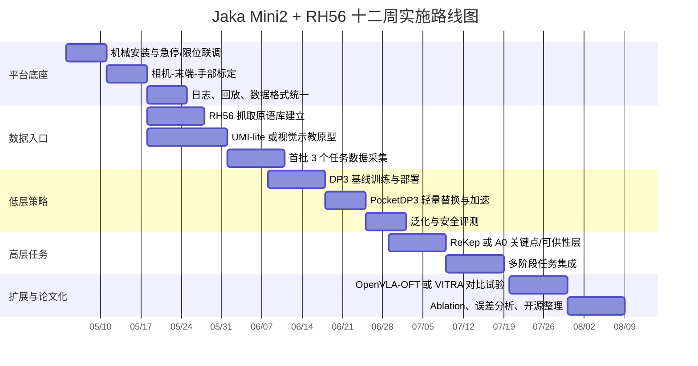

# Jaka Mini2 与 Inspire RH56 平台的具身智能与灵巧操控文献分析报告

## 执行摘要

如果目标是“**新颖且能尽快在 Jaka Mini2 + Inspire RH56 上做出可跑的实验**”，我不建议把第一阶段重心放在大参数量具身基础模型上，而建议优先走三条线：**少样本模仿学习（Diffusion Policy / DP3 / PocketDP3）**、**低成本数据采集与示教（UMI / DexCap / DexUMI / AnyTeleop）**、以及**高层感知—规划叠加低层执行（ReKep / A0）**。原因很直接：你的平台是**单臂 + 单灵巧手、载荷有限、手部自由度中等、接口较工程化**，非常适合桌面轻量任务、点云/视觉模仿、少量示教快速迭代；但不适合直接复现要求**双臂、全掌高分辨触觉、或超高频高维连续手部控制**的系统。citeturn1search1turn24search1turn24search7turn25search0turn26view0turn16search1turn30search3turn42search0

从近三年公开成果看，**真正对你这种 arm-hand 平台“高可复现、低门槛、能快速形成论文原型”的工作，主要集中在 RSS / ICRA / CoRL / arXiv**；CVPR / ICCV 近两年也有很强的 3D 表征与层级操控工作，但 ICML / NeurIPS 在“可直接落地到灵巧手实机”的这条线里相对不是主阵地。本次筛选中，最适合先做的核心组合是：**PocketDP3/DP3 做低层策略，UMI-lite 或 DexUMI-lite 做数据入口，ReKep/A0 做高层任务分解，AnyDexGrasp 做灵巧抓取先导模块**。citeturn15search2turn42search0turn39search0turn21search1turn33search10turn29search1turn30search3

从公开硬件资料看，Jaka Mini 2 的公开参数强调**2 kg 级负载、580 mm 级工作半径、±0.1 mm 重复定位精度**，且官方提供了 **ROS 2 驱动**与 **TCP/IP / Modbus TCP** 通信文档；RH56 官方资料给出**6 DOF、12 个机械关节、6 路内置力传感、约 500 g 重量、24 V 供电、RS485 通讯**，并带有 PC 调参与预设动作序列。这意味着：**桌面轻小物抓取、简单在手重定位、工具抓取、抽屉/门把类轻接触任务都合理；双手协同、大载荷动态接抛、全掌高分辨触觉研究则不应作为第一波目标。**citeturn1search1turn24search1turn24search7turn25search0turn26view0

## 检索范围与平台约束

本报告的文献窗口覆盖 **2023–2026-05-02**，主题限定为：**具身智能、机器人操控、灵巧手、深度学习、模仿学习、VLA、低成本示教、跨手型泛化、3D 视觉策略**。优先来源按可信度与复现价值排序为：**会议正式论文页 / 官方 proceedings、arXiv 预印本、作者项目主页、官方 GitHub/模型仓库、硬件官方文档**。对 2026 年尚未完全沉淀到正式 proceedings 的工作，我优先采用 **arXiv + 项目页 + 官方代码仓**做交叉确认。citeturn15search2turn21search1turn42search2turn23search6turn33search10turn31search1

纳入标准是：**有明确方法创新、与 arm-hand 平台相关、最好含真实机器人或强 sim2real 证据、最好有代码/项目页、且能映射到 Jaka Mini2 + RH56 的实验路径**。排除项包括：**纯导航、闭源产业方案、强依赖双臂/类人全身平台、必须依赖高分辨触觉皮肤且无替代方案、或明显与当前单臂单手平台不匹配的工作**。这也是为什么主表里 RSS / ICRA / CoRL / arXiv 的权重高于 ICML / NeurIPS：对你的平台，后者更多是上游表征或基础模型启发，而不是最短落地路径。citeturn42search0turn39search0turn16search1turn21search1turn30search3

| 假设项 | 当前状态 |
|---|---|
| 预算 | 未指定 |
| 团队规模 | 未指定 |
| 开发语言 | 未指定 |
| 操作系统 | 未指定 |
| 可用 GPU | 未指定 |

在这些条件都“未指定”的情况下，我把优先级明显偏向：**开源、少样本、单臂桌面、低新增硬件、可先用 Python / ROS 2 / MoveIt 2 / PyTorch 跑起来**的路线。若你后续补充了 GPU、相机、示教设备或团队配置，优先级会进一步变化，尤其是 VLA 与可穿戴示教方向。JAKA 官方公开的 ROS 2 驱动当前页面明确支持 MiniCobo 等 6 轴机型，而 RH56 则公开了 RS485 与 PC 工具链，因此默认软件建议可先从 **ROS 2 Humble + MoveIt 2 + Python + PyTorch + 串口桥接**起步。citeturn24search1turn24search6turn24search7turn26view0

## 近三年代表性工作总表

下表以“**是否值得在你当前平台优先复现或借鉴**”为核心排序，不是按纯学术影响力排序。作者列采用“第一作者等”以控制表宽。

| 论文标题 | 作者 | 会议 / 年份 | 研究目标 | 方法要点 | 主要贡献 | 实验设置 | 与 Jaka Mini2 + RH56 的可行性评估 | 可访问链接 |
|---|---|---|---|---|---|---|---|---|
| Diffusion Policy: Visuomotor Policy Learning via Action Diffusion | Cheng Chi 等 | RSS 2023 | 解决多模态、长时序视觉操控中的行为克隆不稳定与误差累积 | 条件扩散策略、receding horizon control、时序扩散 Transformer | 在多基准与真实任务上显著优于传统 BC / IBC，成为后续大量操控工作的低层强基线 | 15 个操控任务、4 个基准、含真实机器人 | **可行**：最适合当第一条低层策略基线；只需把动作定义成“末端位姿 + RH56 低维手势/协同变量” | 论文 / 代码 / 项目页 citeturn15search2turn15search0turn15search1 |
| Learning Fine-Grained Bimanual Manipulation with Low-Cost Hardware | Tony Z. Zhao 等 | RSS 2023 | 用低成本硬件做高精细操控并减少示教量 | ACT（Action Chunking with Transformers）做动作分块预测与时间集成 | 仅约 10 分钟演示即可学会多项精细任务，强烈证明“少样本 + 好动作表示”可行 | ALOHA 双臂低成本平台，6 个真实任务 | **可行**：虽然原文是双臂，但 ACT 可直接迁移到单臂；RH56 可只输出 3–6 个手部协同量而非全关节 | 论文 / 项目页 citeturn14search0turn14search3 |
| AnyTeleop: A General Vision-Based Dexterous Robot Arm-Hand Teleoperation System | Yuzhe Qin 等 | RSS 2023 | 做跨手型、跨机械臂、跨相机配置的统一视觉遥操作 | 手腕与手指分离重定向、统一遥操作栈、跨现实部署 | 证明通用视觉遥操作可以不绑死单一机器人硬件 | 真实与仿真、多臂多手配置 | **需改动**：非常适合做 RH56 示教入口，但你需要为 RH56 重新写手部重定向与校准流程 | 论文 / 项目页 / 相关重定向代码线索 citeturn10search0turn40search7turn40search4 |
| Universal Manipulation Interface: In-The-Wild Robot Teaching Without In-The-Wild Robots | Cheng Chi 等 | RSS 2024 | 不直接遥操作机器人，而在现实世界采集可迁移到机器人的人类演示 | 手持 gripper、相对轨迹表示、推理时延匹配、硬件无关部署接口 | 显著降低示教成本，支持动态、长时程和跨平台部署 | 真实世界多任务实验，强调 portable / low-cost 数据采集 | **需改动**：原始 UMI 更偏 gripper，不是灵巧手；但它的数据接口、轨迹表示和部署思想对 Jaka 很有价值 | 论文 / 项目页 / 代码 citeturn42search0turn42search4turn28search0 |
| DexCap: Scalable and Portable Mocap Data Collection System for Dexterous Manipulation | Chen Wang 等 | RSS 2024 | 解决灵巧手示教采集便携性差与 mocap 到机器人策略难迁移的问题 | SLAM + 电磁跟踪 + 3D 观察；DexIL 从人手 mocap 直接学策略；可带人类在线纠错 | 让“在野外采集灵巧示教”更可行，兼顾数据质量与可部署性 | 6 个挑战性灵巧任务，真实数据采集和策略学习 | **需改动**：你需要新增 mocap/电磁硬件，并建立 RH56 的人手到机器人手映射；但作为第二阶段示教系统极有价值 | 论文 / 代码 / 项目页 citeturn39search0turn39search1turn39search4 |
| 3D Diffusion Policy: Generalizable Visuomotor Policy Learning via Simple 3D Representations | Yanjie Ze 等 | RSS 2024 | 提高视觉模仿在空间泛化与少样本场景下的稳定性 | 稀疏点云表征 + 扩散策略 | 72 个仿真任务和 4 个真实任务显示 3D 表征显著提升泛化与安全性 | 72 仿真任务、4 个真实机器人任务 | **可行**：如果你有 RGB-D，相比 2D BC 更适合桌面操控；对 Jaka + RH56 的单臂 3D 视觉策略很对路 | 论文 / 代码 / 项目页 citeturn16search1turn16search0turn16search2 |
| Octo: An Open-Source Generalist Robot Policy | Dibya Ghosh 等 | RSS 2024 | 做开源、多机器人、多任务的通用策略 | Transformer + diffusion policy，在 Open X-Embodiment 800k 轨迹上预训练 | 提供可微调的开源 generalist policy，降低通用策略门槛 | 多 embodiment、多任务预训练与微调 | **需改动**：对你的平台有价值，但需要动作空间适配、RLDS 数据整理与一定 GPU 资源 | 论文 / 代码 / 项目页 citeturn23search6turn23search1turn23search3 |
| Fine-Tuning Vision-Language-Action Models: Optimizing Speed and Success | Moo Jin Kim 等 | arXiv 2025 | 解决 VLA 微调推理慢、成功率提升有限的问题 | OFT：并行解码、动作分块、连续动作表示、L1 回归目标 | 把 OpenVLA 系路线推向更快推理与更强任务成功率，明显增强“上机价值” | 以 LIBERO 等具身操控评测为主 | **需改动**：很适合做“语言条件分拣/摆放”，但前提是你有足够 GPU 和规范化训练数据 | 论文 / 代码 / 项目页 citeturn9search0turn34search2turn34search5 |
| ReKep: Spatio-Temporal Reasoning of Relational Keypoint Constraints for Robotic Manipulation | Wenlong Huang 等 | CoRL 2024 | 让机器人学会基于关键点关系做可组合操控规划 | 用视觉模型提出 3D 关键点，再把约束写成可优化的 Python cost functions，做层级闭环轨迹生成 | 特别适合长时程、多阶段任务中的可解释规划 | 官方 demo 依托 OmniGibson | **可行**：可直接作为高层“关键点约束规划器”，下接 MoveIt / DP3 / 规则控制器 | 论文 / 代码 / 项目页 citeturn33search15turn33search0turn33search6 |
| A0: An Affordance-Aware Hierarchical Model for General Robotic Manipulation | Rongtao Xu 等 | ICCV 2025 | 提升一般操控中的空间可供性推理 | 两层结构：高层预测接触点/路点，低层执行动作 | 对擦拭、堆叠等需要“哪里接触、怎么动”的任务尤其有效 | HOI4D、ManiSkill-5k 等数据与模型分析，提供预训练与推理脚本 | **需改动**：非常适合做你平台的“高层 affordance 头”，但要自己接上低层控制器 | 论文 / 代码 / 项目页 citeturn33search10turn33search4turn33search1 |
| AnyDexGrasp: General Dexterous Grasping for Different Hands with Human-level Learning Efficiency | Hao-Shu Fang 等 | arXiv 2025 | 做跨手型、少数据的通用灵巧抓取 | 接触中心 grasp representation + 手特定决策层 | 只用数百次尝试、40 个训练物体，就在真实杂乱环境里跨 3 种手型取得高成功率 | 150+ 新物体真实测试、clutter 场景 | **可行**：这是主表里对 RH56 最“对症”的抓取工作之一；你只需重训练 RH56 的手特定层 | 论文 / 代码 / 项目页 citeturn29search1turn29search2turn29search0 |
| DexUMI: Using Human Hand as the Universal Manipulation Interface for Dexterous Manipulation | Mengda Xu 等 | CoRL 2025 | 用人手作为通用接口，把灵巧技能迁往不同机器人手 | 可穿戴手部外骨骼 + 软硬件适配，缩小人手与机器人手的 embodiment gap | 针对“跨灵巧手迁移”问题比 UMI 更贴近 RH56 这种多指手 | 多种机器人手，官方开源 | **需改动**：方向非常契合 RH56，但需要你额外搭建外骨骼/示教装置 | 论文 / 代码 / 项目页 citeturn28search19turn28search1turn28search14 |
| VITRA: Learning Fine-Grained Dexterous Manipulation from Human Videos through Vision-Language Guided Robot Pre-Training | Fangchen Liu 等 | arXiv 2025 / ICRA 2026 | 把人类手部活动视频里的细粒度手—物交互知识迁到机器人操控 | 用真实人类活动视频做手部感知与语言引导的机器人预训练 | 证明 human-hand-centric 视觉先验可提高机器人灵巧操作能力 | 官方已提供项目页与代码 | **需改动**：如果直接从头预训练代价偏大；但若只把其视觉编码器当初始化，非常值得做小数据对比实验 | 论文 / 代码 / 项目页 citeturn8search13turn8search1turn8search16 |
| PocketDP3: Efficient Pocket-Scale 3D Visuomotor Policy | Jinhao Zhang 等 | arXiv 2026 | 在保持 3D 扩散策略效果的同时显著降低模型体积与推理成本 | 用轻量 Diffusion Mixer 代替 DP3 的重 U-Net，支持 2-step inference | 在参数量不到前代 1% 的情况下保持强性能，极适合资源不明或边缘部署场景 | RoboTwin2.0、Adroit、MetaWorld 与真实任务 | **可行**：如果你的 GPU 未指定或一般，这几乎是当前最值得先上机的 2026 新工作之一 | 论文 / 代码 citeturn30search3turn30search7 |
| UMI-3D: Extending Universal Manipulation Interface from Vision-Limited to 3D Spatial Perception | Ziming Wang | arXiv 2026 | 解决原始 UMI 在遮挡、动态场景、SLAM 跟踪丢失下的数据质量问题 | 腕部 LiDAR + 相机 + IMU，同步采集、SLAM、统一时空标定 | 在保持 UMI 便携性的前提下，把示教质量提升到更适合真实复杂任务的程度 | 官方给出硬件、SLAM、数据处理与策略管线，项目页强调低成本与 fully open-source | **需改动**：要额外加 LiDAR/腕部传感硬件；但若你想做门/抽屉/遮挡任务，这是很强的升级路线 | 论文 / 项目页 / 代码 citeturn31search1turn31search0turn31search2 |
| UltraDexGrasp: Learning Universal Dexterous Grasping for Bimanual Robots with Synthetic Data | Sizhe Yang 等 | ICRA 2026 | 做面向双手机器人的通用灵巧抓取 | 大规模合成数据管线 + 双手抓取泛化 | 代表 2026 年双手通用抓取前沿 | 面向 bimanual robots 的合成数据与 grasps | **不可行**：与你当前“单臂 + 单手”硬件形态不匹配；除非后续加第二臂/第二手，否则不建议作为第一阶段 | 代码仓 / 作者页 / 项目页线索 citeturn30search1turn30search5turn30search17 |

主表之外，仍有几篇值得关注但我不建议你放入**第一波实机路线**：**Open X-Embodiment** 是上游多机器人数据和 RT-X 模型资源；**FAST** 面向高频 VLA 动作 tokenization；**DexVLA** 做跨 embodiment 的 plug-in diffusion expert；**DextrAH-RGB** 是端到端 RGB 灵巧抓取；**UniHM** 是语言驱动的统一灵巧手序列生成；**Robot Synesthesia** 则代表视觉—触觉融合在在手操作中的能力上限。它们都很新，也都重要，但在你当前平台上，要么计算与工程代价更高，要么需要额外传感器或更复杂的手部闭环。citeturn22search2turn34search3turn33search2turn19academia19turn30search4turn39search7

## 面向现有平台的快速项目想法

考虑到 JAKA 官方已公开 ROS 2 与 TCP/IP / Modbus 路线，而 RH56 公布了 RS485 / PC 工具链，我建议默认软件栈以 **ROS 2 Humble + MoveIt 2 + Python + PyTorch + 串口桥接**起步，先把手部控制抽象成**“若干动作原语 / 协同变量 / 力阈值参数”**，不要在第一周就尝试全关节高频控制。这样最符合 RH56 的公开接口特征，也更容易把论文方法快速接到实机上。citeturn24search1turn24search7turn26view0

| 项目想法 | 目标 | 关键技术路线 | 预期难点 | 所需软硬件 | 快速原型周期 | 成功指标 | 启发来源 |
|---|---|---|---|---|---|---|---|
| RH56 抓取原语库与功能抓取基准 | 建立 20–30 个轻小物体的稳定抓取与功能抓取基准 | 用 RH56 预设动作 + 相机位姿估计 + 力阈值搜索，做 lateral pinch / tripod / power grasp 库 | 拇指姿态标定、不同物体摩擦差异 | 现有平台 + RGB-D 相机 + AprilTag + RS485 转接 | 1–2 周 | 首次抓取成功率 >85%；工具朝向误差 <15°；掉落率 <10% | RH56 动作序列、AnyDexGrasp、DEX 操控思路 citeturn26view0turn29search1 |
| PocketDP3 桌面模仿学习基线 | 在 3 个单臂桌面任务上做少样本 3D 模仿学习 | RGB-D 点云 + 末端位姿 + 手部协同动作；先复现 DP3，再替换 PocketDP3 | 时序同步、点云裁剪、动作空间设计 | 现有平台 + RGB-D + PyTorch | 2–4 周 | 20–40 demos/任务可达 >70% 成功率；推理延迟 <80 ms | DP3、PocketDP3 citeturn16search1turn30search3 |
| UMI-lite 手持示教器 | 用极低成本手持接口加速收集单臂轨迹示教 | 借鉴 UMI 的相对轨迹表示，做 3D 打印手持末端示教器，先只示 arm pose，手部用抓取原语补足 | 时延匹配、姿态漂移、轨迹重放平滑性 | 3D 打印件、腕部相机或手机、现有平台 | 2–4 周 | 示教效率 >80 条轨迹/天；30 条示教后任务成功率 >60% | UMI citeturn42search0turn42search4 |
| AnyTeleop / DexUMI-lite 视觉示教 | 用摄像头或头显做人手到 RH56 的在线遥操作示教 | MediaPipe / 头显手追踪 + RH56 手指映射 + Jaka wrist pose 控制 | RH56 人手—机器人手重定向、低延迟与防抖 | 摄像头或 Quest、现有平台、串口/网络桥接 | 3–6 周 | 端到端延迟 <120 ms；可稳定收集 50 条以上有效示教 | AnyTeleop、DexUMI citeturn10search0turn28search19 |
| AnyDexGrasp 迁移到 RH56 | 做 50+ 新物体的少样本灵巧抓取泛化 | 训练通用接触表征，单独训练 RH56 决策头；先做桌面 clutter grasp | RH56 手型参数化、抓取数据标注与筛选 | RGB-D、点云处理、少量抓取试验台 | 3–6 周 | 未见物体 clutter grasp 成功率 >75% | AnyDexGrasp citeturn29search1turn29search2 |
| OpenVLA-OFT 指令条件分拣 | 让系统理解自然语言并执行“拿红杯子放左盘”等指令 | 用 OpenVLA-OFT 微调，动作输出映射到 arm pose + hand primitive | RLDS 数据格式、推理资源、语言到动作的 adapter | GPU（未指定）、现有平台、语言指令采集 | 3–6 周 | seen 指令 >85%，paraphrase 指令 >70% | OpenVLA / OFT、LIBERO citeturn21search1turn34search5turn35search4 |
| ReKep / A0 高层可供性规划 | 提升多阶段任务（如开抽屉再取物）的成功率 | ReKep 生成关键点约束或 A0 生成 affordance/waypoint，下接 MoveIt 或 DP3 控制器 | 关键点稳定性、视觉分割、阶段切换鲁棒性 | 现有平台 + RGB-D + 规划栈 | 3–5 周 | 3 个长时程任务阶段成功率 >70% | ReKep、A0 citeturn33search15turn33search10 |
| 视觉—力融合接触任务 | 在不加高分辨触觉皮肤的情况下做擦拭/插入/按压 | 用 RH56 内置力反馈 + 视觉，做一层 force-aware policy 或状态机补偿 | 力数据刷新率与噪声、接触相位切换 | 现有平台 + 力日志采样 + 简单治具 | 3–5 周 | 插入成功率 >60%；峰值接触力低于阈值；失败不过冲 | RH56 力传感、Diffusion Policy / DP3 思路 citeturn25search0turn15search2turn16search1 |
| UMI-3D 遮挡与关节物体任务 | 做 vision-only 容易失败的门把、抽屉、布料边角任务 | 腕部低成本 LiDAR 或类似 3D 传感，沿 UMI-3D 思路做同步采集与 SLAM | 标定、传感器安装、数据处理流程 | 额外 LiDAR/IMU、现有平台 | 4–6 周 | 相比纯视觉采集，关键任务成功率提升 >15 个百分点 | UMI-3D citeturn31search1turn31search0 |
| VITRA 编码器小数据适配 | 验证“人类手部视频预训练”能否减少机器人示教需求 | 取 VITRA 的视觉编码器或特征层做初始化，再在 RH56 small-data 上微调 | 权重迁移、human-hand 与 robot-hand 视角偏差 | GPU（未指定）、现有平台、公开视频与少量机器人数据 | 4–8 周 | 达到同等成功率所需 demos 数减少 30–50% | VITRA citeturn8search13turn8search16 |

## 优先级建议

如果只从“**实现难度、创新性、发表潜力、资源需求**”四个维度综合排序，我给出的建议是：**先做 PocketDP3/DP3 + RH56 抓取原语库，其次做 UMI-lite 或视觉示教入口，再做 ReKep/A0 高层叠加，最后再上 OpenVLA-OFT 或 VITRA 这类更重的模型路线。** 这是最符合你当前“硬件已定、预算未指定、GPU 未指定、想尽快出实验”的路径。citeturn16search1turn30search3turn42search0turn33search15turn33search10turn34search5turn8search13

具体而言，**首选优先级**是“**RH56 抓取原语库 + PocketDP3/DP3**”。它的好处是：一方面工程闭环最短，不需要额外外骨骼、LiDAR 或 7B 级模型；另一方面，DP3 和 PocketDP3 的 3D 视觉表征天然适合桌面轻操控，PocketDP3 又把参数与推理成本压得更低，非常适合“GPU 未指定”的现实条件。这个组合也最容易做出完整实验链：感知、数据采集、训练、部署、泛化、失败分析，一个都不少。citeturn16search1turn16search2turn30search3turn30search7

**第二优先级**是“**UMI-lite / AnyTeleop / DexUMI-lite 数据入口**”。其意义不只是多一个示教工具，而是它直接决定你后续所有模型的迭代速度。很多灵巧手论文真正的核心不在 backbone，而在**演示数据的可采性、可迁移性和时延一致性**。如果你先把一套低成本、稳定的数据入口搭好，你后面换 DP3、ReKep、OpenVLA 都会轻松很多。citeturn42search0turn10search0turn28search19turn39search0

**第三优先级**是“**ReKep / A0 高层叠加**”。这是最有“论文味”的方向：你可以在不推翻底层控制器的前提下，为系统加上可解释的关键点约束、可供性点或路点推理，快速把任务从“单步抓取”升级到“多阶段任务执行”。在学术上，这比单纯追求更高抓取成功率更容易写成有结构的故事；在工程上，它又比从头训练一个重型 VLA 简单得多。citeturn33search15turn33search6turn33search10turn33search1

**第四优先级**才是“**OpenVLA-OFT / VITRA / 更重的 VLA**”。这类路线的上限很高，尤其适合做自然语言条件操控、跨任务泛化和数据效率论文；但前提是你要么有更充足 GPU，要么已有规范化数据栈。否则它们很容易变成“模型接进来了，但系统整体没跑稳”的状态。对当前平台，VLA 更适合作为**第二阶段增强层**，而不是第一阶段主干。citeturn34search5turn21search1turn8search13

## 实施路线图与评测方案

我建议把实施分为四层：**平台层、数据层、低层策略层、高层任务层**。平台层先解决 Jaka arm 与 RH56 hand 的控制抽象、安全限位、统一日志和标定；数据层先做 UMI-lite / 视觉示教或短时人工引导；低层策略层先上 DP3 / PocketDP3；高层任务层再接 ReKep / A0 或 OpenVLA-OFT。这样做的核心优势是：**每一层都能独立验收，也能独立写 ablation。**citeturn24search1turn24search7turn26view0turn16search1turn30search3turn33search15turn33search10

评测上，我建议把指标拆成 **五组**。第一组是**基础成功率**：单次成功率、首试成功率、掉落率、平均用时、恢复次数。第二组是**泛化**：未见物体、未见摆放位置、未见光照/背景、未见指令措辞。第三组是**安全**：超力阈次数、碰撞次数、紧急停机次数、越界动作比例。第四组是**效率**：达到 80% 成功率所需 demos 数、训练时长、推理时延、显存占用。第五组是**系统性误差**：标定误差、时延误差、抓取朝向误差、接触峰值力。对于你这种“单臂 + 灵巧手”的论文，评审最看重的通常不是单个数字，而是你有没有把**数据效率、泛化、稳定性、安全性**一起讲清楚。citeturn15search2turn16search1turn30search3turn34search5

基准与数据集我建议分成**仿真预训练 / 算法对比**和**实物评测**两层。仿真层可以用 **LIBERO** 做语言条件桌面任务、**RLBench** 做多任务/少样本对比、**DexArt** 做灵巧手操控关节物体、**ManiSkill3** 做高并发接触任务开发；抓取方向可参考 **GraspNet-1Billion** 和 **DexGraspNet 2.0** 的对象与抓取资源。真实评测层则建议至少准备一套 **YCB 小子集**，如果你要做 6D 目标识别或物体级条件指令，再加 **HOPE** 一类的 household object pose 数据。citeturn35search4turn35search1turn35search2turn37search1turn36search7turn35search11turn36search0turn36search1turn36search5

一个很实用的实验设计是这样的：先在 **LIBERO / RLBench / ManiSkill3** 中完成算法 sanity check，再在真实平台上选择 **3 个代表任务**做闭环验证：**目标分拣**、**轻接触任务（擦拭/插入）**、**工具或关节物体任务（开抽屉/拉门把）**。这样你既能对齐主流论文，又不会在第一波实验里把任务铺得太散。若你后面转向 VLA，再额外加一个语言 paraphrase 测试集，参考 2026 年新出的 **LIBERO-X / LIBERO-Para** 的思路做语义鲁棒性检查即可。citeturn35search4turn35search1turn37search1turn38search0turn38search2

### 开放问题与局限

本报告优先选择了**开源可访问、项目页可验证、能较快映射到你现有平台**的工作。因此，一些很强但**闭源、硬件依赖极强、或仍停留在重量级预训练阶段**的路线没有被列为优先。尤其是 2026 年的新作里，像 **UMI-3D**、**UltraDexGrasp** 这类工作虽然很前沿，但当前仍主要依赖 arXiv / 项目页 / 代码仓来判断工程成熟度，最终复现成本与正式版本细节仍可能变化。你的预算、GPU、团队规模、操作系统都未指定，所以凡是涉及 7B 级 VLA、LiDAR 新增硬件、或可穿戴外骨骼的路线，我都保守地标成了“需改动”而不是默认推荐。citeturn31search1turn30search5turn21search1turn8search13

## 引用与链接清单

本报告核心参考分为四组：**硬件官方文档、可直接上机的方法论文、前沿扩展路线、评测与数据基准**。为避免把正文做成纯链接堆砌，下面给出按组归类的原始来源入口。

**硬件与软件接口**：Jaka Mini 2 官方产品页 / 参数页；JAKA 官方 ROS 2 驱动与 TCP/IP、Modbus 文档；RH56 系列官方说明书与操作说明。citeturn1search1turn24search1turn24search6turn24search7turn25search0turn26view0

**低层策略与示教系统**：Diffusion Policy；ACT / ALOHA；AnyTeleop；UMI；DexCap；DP3；AnyDexGrasp；DexUMI；PocketDP3；UMI-3D。citeturn15search2turn15search0turn15search1turn14search0turn14search3turn10search0turn40search7turn42search0turn42search4turn28search0turn39search0turn39search1turn39search4turn16search1turn16search0turn16search2turn29search1turn29search2turn29search0turn28search19turn28search1turn28search14turn30search3turn30search7turn31search1turn31search0turn31search2

**通用策略、高层规划与前沿扩展**：Octo；OpenVLA / OFT；ReKep；A0；VITRA；Open X-Embodiment；FAST；DexVLA；DextrAH-RGB；UniHM；UltraDexGrasp。citeturn23search6turn23search1turn23search3turn21search1turn21search7turn34search5turn34search2turn33search15turn33search0turn33search6turn33search10turn33search4turn33search1turn8search13turn8search1turn8search16turn22search2turn22search1turn34search3turn33search2turn33search5turn19academia19turn19search0turn30search4turn30search1turn30search5turn30search17

**评测与数据基准**：LIBERO；RLBench；DexArt；ManiSkill3；GraspNet-1Billion；DexGraspNet 2.0；YCB；HOPE；LIBERO-X；LIBERO-Para。citeturn35search4turn35search0turn35search1turn35search5turn35search2turn35search14turn37search1turn37search0turn36search7turn35search11turn36search0turn36search1turn36search5turn38search0turn38search2

综合本次检索，我的最终建议可以压缩成一句话：**先把 RH56 当作“带有限力反馈的低维灵巧末端”而不是“高维研究级灵巧手”，先用 PocketDP3/DP3 + UMI-lite 跑通真实任务，再用 ReKep/A0 或 OpenVLA-OFT 往上叠智能层。** 这样最符合你当前硬件的真实优势，也最容易在三个月内形成**能演示、能对比、能写论文**的结果。citeturn30search3turn16search1turn42search0turn33search15turn33search10turn34search5